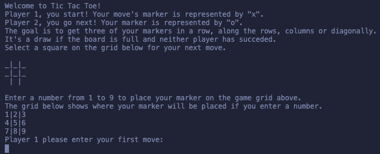

## Command Line Tic Tac Toe
Welcome to Command Line Tic Tac Toe.
Tic Tac Toe is a two player game, in which players take turns placing their marker, either an X or an O, on a 3 by 3 grid.
The player that successfully places three of their markers in a horizontal, diagonal or vertical row wins.
If the board is full and no player has succeeeded completing a row of three, it's a draw.

## Built With

1. Ruby

## How to play online

> Click on the Game Link below to start playing online!

[Game Link](https://repl.it/@m15e/tic-tac-toe)

1. Click on the link above to play online on [repl.it](https://repl.it)
2. Wait for the terminal on the right to complete loading 
3. Enter `bin/main.rb` to start playing.

## How to play on your local machine

To get a local copy up and running follow these simple example steps.

1. You need to have [Ruby](https://www.ruby-lang.org/en/) installed on your computer to run this game.
2. You should be able to run `terminal`, `command prompt`, `bash` or `Powershell` to open your command line.
3. Run `git clone https://github.com/m15e/tic-tac-toe` to clone this repository to your local machine.
4. Run `cd tic-tac-toe` to go to the game folder.
5. Run `bin/main.rb` to start the game and follow the in-game instructions.

### Prerequisites

- Ruby
- Commandline, Terminal, Prompt, Bash or Powershell

## Authors

👤 **Mark Rode**

- Github: [@m15e](https://github.com/m15e)

👤 **Guy Gustave Nigaba**

- Github: [@Guy-Gustave](https://github.com/Guy-Gustave)
- LinkedIn: [Guy Gustave Nigaba](https://www.linkedin.com/in/guy-gustave-nigaba/)
- Twitter: [@NigabaG](https://twitter.com/NigabaG)

## Show your support

Give a ⭐️ if you like this project!

## Acknowledgments

- The Odin Project
- Microverse

This project is [MIT](lic.url) licensed.